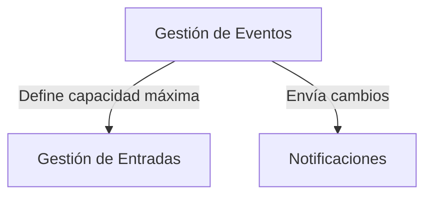
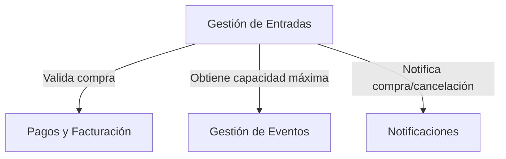
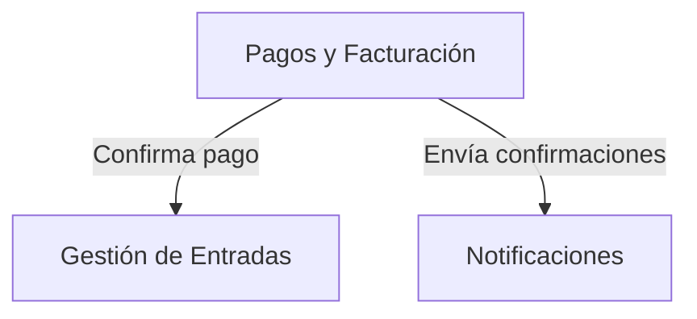
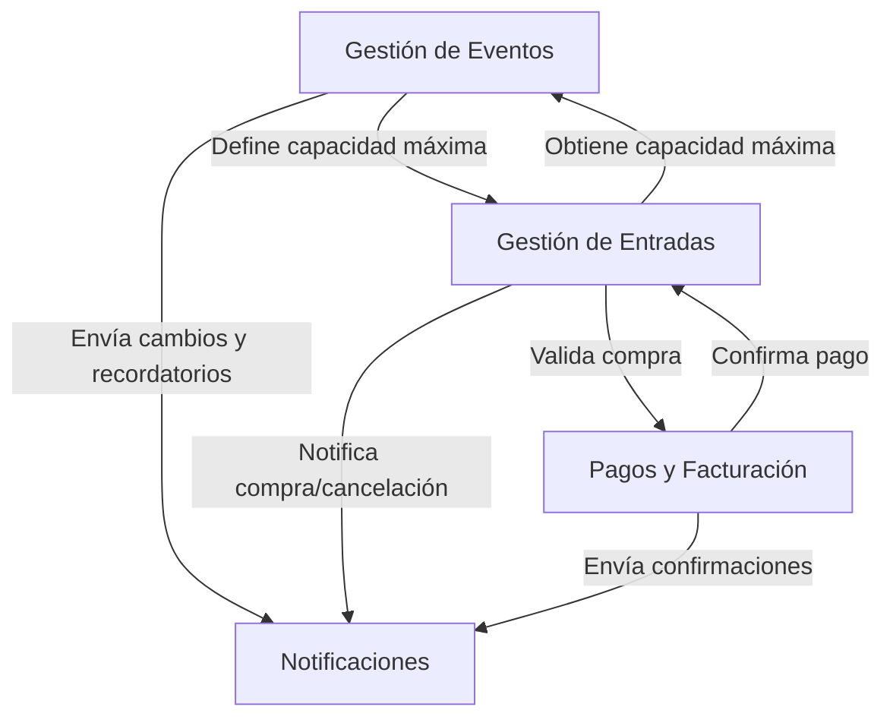

# Tarea 1: Sistema de Gestión de Eventos

Estudiante: Valeria Chinchilla Mejías

## Descripción del sistema

La aplicación propuesta permite la creación, administración y venta de entradas para eventos. Los organizadores pueden configurar eventos con precios y disponibilidad de entradas, mientras que los usuarios pueden explorar los eventos, comprar las entradas y recibir notificaciones sobre cambios o recordatorios.

## Contextos delimitados

Para esta aplicación se han identificado los siguientes bounded context que luego podrán convertirse en microservicios.

### 1. Gestión de Eventos

#### Funcionalidad

Permite a los organizadores crear, editar y administrar eventos

#### Entidades principales

- Evento (ID, , idOrganizador, nombre, fecha, ubicación, descripción, capacidad)
- Usuario (ID, nombre, email, contacto, tipo [Organizador/Comprador])

#### Interacciones

- Se comunica con `Gestión de Entradas` para definir disponibilidad y asignar entradas.
- Envía datos a `Notificaciones` para informar a los usarios asistentes del evento sobre cambios o novedades.

### 2. Gestión de Entradas

#### Funcionalidad

Maneja la venta, disponibilidad y validación de entradas

#### Entidades principales

- Entrada (ID, idEvento, idComprador, tipo, precio, estado)
- Usuario (ID, nombre, email, contacto, tipo [Organizador/Comprador])

#### Interacciones

- Se conecta con `Pagos y Facturación` para procesar compras y validarlas.
- Obtiene información de `Gestión de Eventos` sobre disponibilidad y eventos.
- Notifica a `Notificaciones` cuando se confirma o cancela una compra.

### 3. Pagos y Facturación

#### Funcionalidad

Procesa pagos, genera facturas y gestiona reembolsos.

#### Entidades principales

- Transacción (ID, idUsuario, idEvento, monto, estado)
- Factura (ID, idUsuario, idEvento, detalles, fecha)

#### Interacciones

- Se comunica con `Gestión de Entradas` para validar compras.
- Se comunica con `Notificaciones` para enviar confirmaciones de pago y reembolsos.

### 4. Notificaciones

#### Funcionalidad

Envía confirmaciones de compra, recordatorios y actualizaciones sobre eventos a los usuarios.

#### Entidades principales

- Notificación (ID, idUsuario, tipo, contenido, estado)

#### Interacciones

- Recibe datos de `Gestión de Eventos` para enviar recordatorios y cambios en la programación.
- Recibe información de `Pagos y Facturación` para notificar confirmaciones de compra o reembolsos.
- Envía correos electrónicos y notificaciones a los usuarios.

## Interacciones de todo el sistema

## Justificación

Esta división en contextos delimitados sigue el principio de separación de responsabilidades y facilita la escalabilidad del sistema:

1. **Gestión de Eventos** se centra en la creación y administración de eventos, lo que permite a los organizadores configurar sus actividades sin preocuparse por la venta de entradas o los pagos.

2. **Gestión de Entradas** maneja la compra, validación y disponibilidad de entradas, manteniendo un control claro sobre el acceso a los eventos.

3. **Pagos y Facturación** separa la lógica financiera para gestionar transacciones y facturación de manera segura e independiente.

4. **Notificaciones** se encarga de la comunicación con los usuarios, lo que permite una mejor organización y evita sobrecargar los demás servicios con tareas de mensajería.

La implementación de esta estructura elimina dependencias innecesarias entre los diferentes contextos, lo que mejora la flexibilidad en el desarrollo y además, permite que cada área evolucione sin afectar las demás. Asimismo, facilita el uso de tecnologías distintas para cada uno, como bases de datos especializadas o lenguajes de programación más adecuados según las necesidades de cada contexto.
