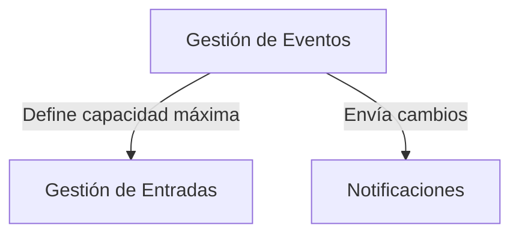
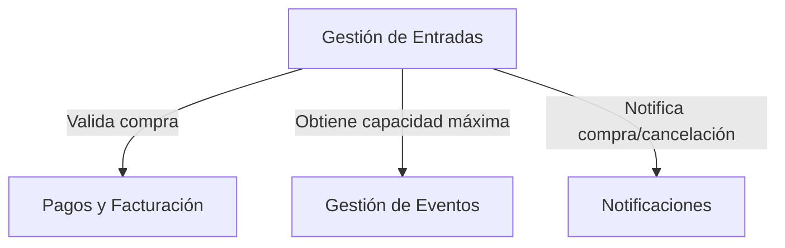
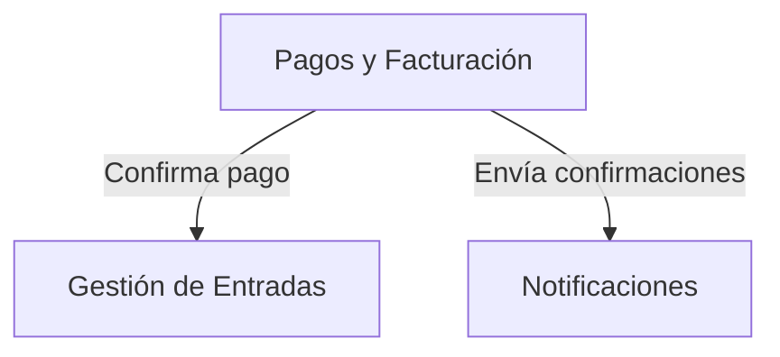
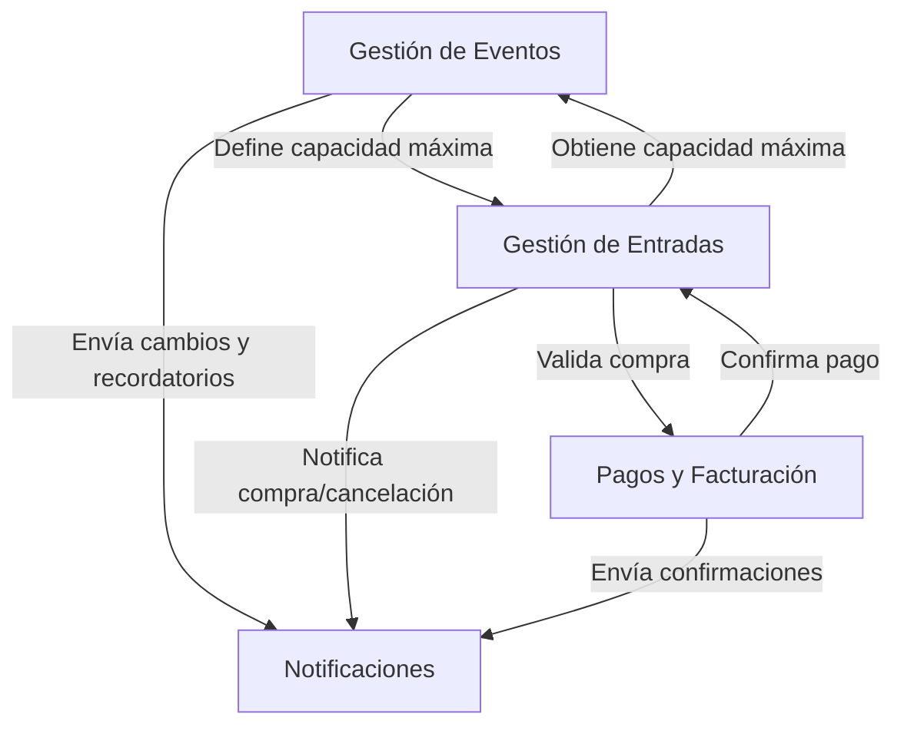

### 1. Eventos

#### Funcionalidad

Permite a los organizadores crear, editar y administrar eventos

#### Entidades principales

- Evento (ID, , idOrganizador, nombre, fecha, ubicación, descripción, capacidad)
- Usuario (ID, nombre, email, contacto, tipo [Organizador/Comprador])

#### Interacciones

- Se comunica con `Gestión de Entradas` para definir disponibilidad y asignar entradas.
- Envía datos a `Notificaciones` para informar a los usarios asistentes del evento sobre cambios o novedades.

### 2. Entradas

#### Funcionalidad

Maneja la venta, disponibilidad y validación de entradas

#### Entidades principales

- Entrada (ID, idEvento, idComprador, tipo, precio, estado)
- Usuario (ID, nombre, email, contacto, tipo [Organizador/Comprador])

#### Interacciones

- Se conecta con `Pagos y Facturación` para procesar compras y validarlas.
- Obtiene información de `Gestión de Eventos` sobre disponibilidad y eventos.
- Notifica a `Notificaciones` cuando se confirma o cancela una compra.

### 3. Pagos y Facturación

#### Funcionalidad

Procesa pagos, genera facturas y gestiona reembolsos.

#### Entidades principales

- Transacción (ID, idUsuario, idEvento, monto, estado)
- Factura (ID, idUsuario, idEvento, detalles, fecha)

#### Interacciones

- Se comunica con `Gestión de Entradas` para validar compras.
- Se comunica con `Notificaciones` para enviar confirmaciones de pago y reembolsos.

### 4. Notificaciones

#### Funcionalidad

Envía confirmaciones de compra, recordatorios y actualizaciones sobre eventos a los usuarios.

#### Entidades principales

- Notificación (ID, idUsuario, tipo, contenido, estado)

#### Interacciones

- Recibe datos de `Gestión de Eventos` para enviar recordatorios y cambios en la programación.
- Recibe información de `Pagos y Facturación` para notificar confirmaciones de compra o reembolsos.
- Envía correos electrónicos y notificaciones a los usuarios.

## Interacciones de todo el sistema

