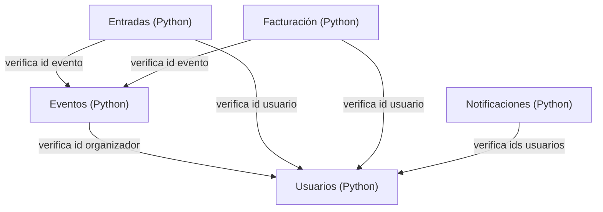

# Implementación de APIs REST

Este proyecto implementa una arquitectura de microservicios utilizando Docker. Cada servicio está desarrollado en Python y expone una API REST para gestionar diferentes aspectos del sistema.

# 📦 Microservicios

## 1. Usuarios (Python)

**Función:**

- Gestionar usuarios.

**API REST:**

- `GET /users`: Obtiene todos los usuarios.
- `GET /users/<id>`: Obtiene un usuario por ID.
- `POST /users`: Crea un nuevo usuario.
- `PUT /users/<id>`: Actualiza un usuario existente.
- `DELETE /users/<id>`: Elimina un usuario.
- `GET /users/<id>/is_organizer`: Verifica si un usuario es organizador.

## 2. Eventos (Python):

**Función:**

- Gestionar eventos.

**API REST:**

- `GET /events`: Obtiene todos los eventos.
- `GET /events/<id>`: Obtiene un evento por ID.
- `POST /events`: Crea un nuevo evento (verifica si el organizador es válido).
- `PUT /events/<id>`: Actualiza un evento existente.
- `DELETE /events/<id>`: Elimina un evento.

## 3. Entradas (Python):

**Función:**

- Gestionar entradas.

**API REST:**

- `GET /tickets`: Obtiene todas las entradas.
- `GET /tickets/<id>`: Obtiene una entrada por ID.
- `POST /tickets`: Crea una nueva entrada (verifica usuario y evento).
- `PUT /tickets/<id>`: Actualiza una entrada existente.
- `DELETE /tickets/<id>`: Elimina una entrada.

## 4. Facturación (Python):

**Función:**

- Gestionar facturas.

**API REST:**

- `GET /bills`: Obtiene todas las facturas.
- `GET /bills/<id>`: Obtiene una factura por ID.
- `POST /bills`: Crea una nueva factura (verifica usuario y evento).
- `PUT /bills/<id>`: Actualiza una factura existente.
- `DELETE /bills/<id>`: Elimina una factura.

## 5. Notificaciones (Python):

**Función:**

- Gestionar notificaciones.

\***\*API REST:\*\***

- `GET /notifications`: Obtiene todas las notificaciones.
- `GET /notifications/<id>`: Obtiene una notificación por ID.
- `POST /notifications`: Crea una nueva notificación (verifica usuarios).
- `PUT /notifications/<id>`: Actualiza una notificación existente.
- `DELETE /notifications/<id>`: Elimina una notificación.

# 🔗 Conexiones



# 🚀 Pasos para Ejecutar el Proyecto

1. Clonar el Repositorio:

```
git clone https://github.com/valeriach30/Arquitectura.git
cd Tarea 2
```

2. Construir los Contenedores:

```
docker compose build
```

3. Iniciar los servicios

```
docker compose up -d
```

4. Verificar que los contenedores están corriendo

```
docker ps
```

5. Acceder a las APIS

- Usuarios: http://localhost:5000
- Eventos: http://localhost:5001
- Entradas: http://localhost:5002
- Facturación: http://localhost:5003
- Notificaciones: http://localhost:5004
