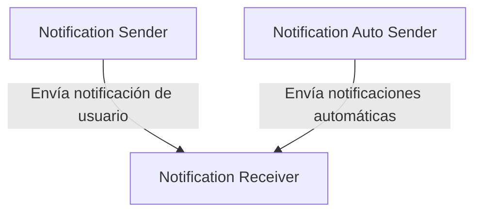

# Implementación de mensajería asincronica

Este proyecto demuestra cómo implementar comunicación asíncrona entre microservicios usando RabbitMQ y Docker. Todos los servicios están desarrollados en Python y se comunican a través de una cola de mensajes.

# 📦 Microservicios

## 1. Notification auto sender (Python)

**Función:**

- Envía notificaciones automáticas a la cola cada 5 segundos (útil para pruebas).

## 2. Notification sender (Python)

**Función:**

- Envía notificaciones definidas por el usuario desde una interfaz Swagger.

## 3. Notification receiver (Python)

**Función:**

- Recibe y procesa las notificaciones desde la cola.

# 🔗 Conexiones



# 🚀 Pasos para Ejecutar el Proyecto

1. Clonar el Repositorio:

```
git clone https://github.com/valeriach30/Arquitectura.git
cd 'Tarea 3'
```

2. Construir los Contenedores:

```
docker compose build
```

3. Iniciar los servicios

```
docker compose up -d
```

4. Verificar que los contenedores están corriendo

```
docker ps
```

5. Acceder a las interfaces

- 🧪 Flassger: http://localhost:5000/apidocs
- 🐇 RabbitMQ: http://localhost:15672

# 📄 Logs y Monitoreo

Para ver los logs en tiempo real y cómo se procesan las notificaciones:

```
docker compose logs -f
```
